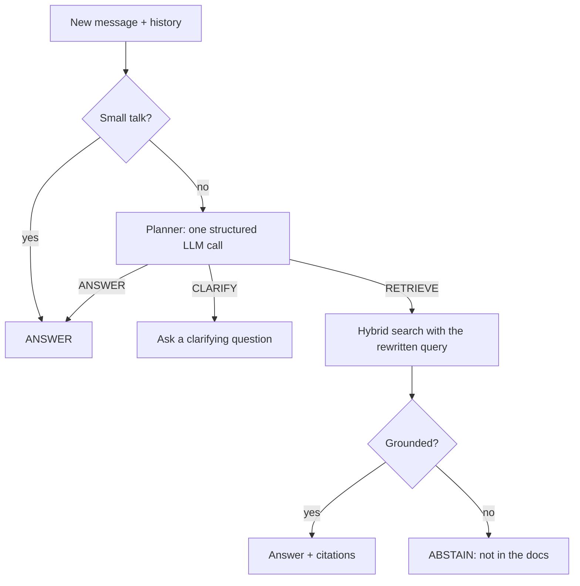

# openRag

**The RAG layer beneath any chatbot.**

Point openRag at your documents and bring your own LLM. You get a chatbot backend that answers with citations, follows the conversation, and says so when the answer isn't in your docs. You own the UI and the product; openRag handles everything underneath.


> **Status:** openRag is in the design phase and not yet published. The API shown here is the v1 target and may change before the first release.

## Contents

- [Why openRag](#why-openrag)
- [Features](#features)
- [Quick look](#quick-look)
- [How it works](#how-it-works)
- [Extending openRag](#extending-openrag)
- [Evaluation](#evaluation)
- [Roadmap](#roadmap)
- [Documentation](#documentation)

## Why openRag

A chatbot over your own docs sounds simple. A good one needs a lot of parts:

- loaders and parsers for each source format
- chunking that doesn't cut an answer in half
- an embedding model and a vector store
- retrieval that matches exact terms (error codes, product names) as well as meaning
- prompts that keep the model grounded, plus citations back to the source
- multi-turn memory, so *"and what about international orders?"* still works
- a way to refuse when the docs don't have the answer

openRag puts all of this behind one API with sensible defaults. You can replace any part when you outgrow it.

## Features

- **One-line start.** A working bot over a folder of docs in three lines of code.
- **Hybrid retrieval.** Keyword and vector search are fused, so exact terms and paraphrases both match. Reranking is optional.
- **Built for conversations.** Follow-ups are rewritten into standalone queries. Vague questions get a clarifying question back. Topic switches drop stale context.
- **Knows when to stop.** When retrieval finds nothing solid, the bot abstains instead of guessing from the nearest-looking chunk.
- **Citations on every answer.** Each answer points back to the source file and section.
- **Streaming.** Typed events (action, tokens, citations) come through an async iterator, plus a one-line helper for Server-Sent Events. An AI SDK adapter lets a frontend use `useChat` directly.
- **Trace on every reply.** Each reply shows what the bot planned, retrieved and sent to the model.
- **Incremental indexing.** Only changed documents are processed again.
- **No infrastructure by default.** Everything runs locally with an embedded store, so there's no database server to run. Production setups can switch to Postgres.
- **Bring your own LLM.** Anthropic, OpenAI or a local model through Ollama, detected from your environment.
- **Usable as a tool.** `retrieve()` returns ranked chunks, citations and a grounding signal without calling an LLM, so agents and routers can use openRag as one tool among many.
- **Namespaces.** Each tenant's documents stay isolated inside one store.
- **Swap any layer.** Every stage is an interface with a default implementation.

## Defaults

Chosen by measurement rather than opinion. The run is written up in `experiments/m0/`.

| Part | Default | Why |
|---|---|---|
| Chunking | Heading-aware, up to 256 tokens, each piece prefixed with its `page › heading` | Best top-1 result, and it never split an answer across two pieces |
| Store | One SQLite file (sqlite-vec + FTS5) | Keyword search 76% vs 43% for the pure-JS alternative, and a 3.5× smaller index |
| Embedder | `bge-small-en-v1.5`, local, 33 MB | 88% on its own; a 325 MB model reached 93% but indexed 32× slower |
| Retrieval | Keyword + vector, fused and reranked | Fusing without a reranker *hurt* reworded questions (87% → 67%) |
| LLM | Yours | openRag never hosts or pays for a model |

## Quick look

### Level 1: zero config

```ts
// .env: ANTHROPIC_API_KEY=…  (or OPENAI_API_KEY, or a running Ollama)
import { Bot } from "openrag";

const bot = new Bot({ sources: ["./docs"] });
const reply = await bot.ask("What is the refund policy?");

reply.answer;     // "Refunds are accepted within 30 days…"
reply.citations;  // [{ uri: "docs/refunds.md", heading: "Refunds › Window", score: 0.82 }]
```

### Level 2: multi-turn, streaming, configured

```ts
const bot = new Bot({
  sources: ["./docs", "https://docs.example.com"],
  llm: myModel, // any AI SDK model, or your own adapter
  store: pgvector(process.env.DATABASE_URL),
  abstain: true,
});

for await (const ev of bot.chat({ session: "user-42", message: "and for international orders?" })) {
  if (ev.type === "action")   ui.status(ev.action);   // RETRIEVE · ANSWER · CLARIFY · ABSTAIN
  if (ev.type === "token")    ui.append(ev.text);
  if (ev.type === "citation") ui.cite(ev.citation);
  if (ev.type === "done")     log(ev.trace);
}

// Next.js route handler: streams the reply as Server-Sent Events
export const POST = (req: Request) => bot.chat.toResponse(req);
```

### Level 3: swap any layer

```ts
const bot = new Bot({
  sources: ["./docs"],
  chunker:   myChunker,                             // anything implementing Chunker
  embedder:  voyage("voyage-3"),
  retriever: hybrid({ lexical: 0.3, vector: 0.7 }),
  reranker:  cohereRerank(),
  sessions:  redisSessions(process.env.REDIS_URL),
});
```

### As a tool for agents

```ts
const kb = new Bot({ sources: ["./acme-docs"], namespace: "acme" });

const result = await kb.retrieve("refund policy for international orders");
result.chunks;     // ranked chunks, each with source, heading and score
result.grounded;   // false → try another tool, or escalate

const tool = kb.asTool();   // { name, description, inputSchema, run } for any agent loop
```

Each level works without the one above it. Later versions make Level 1 smarter without changing its code.

## How it works

openRag has six layers under one public API. **Indexing** runs when your sources change. **Chat** runs once per turn.

| Layer | Responsibility |
|---|---|
| **Ingestion** | Load files, folders and URLs. Parse Markdown, HTML and plain text. Split into heading-aware chunks. Skip unchanged documents. |
| **Index** | Store chunks with their embeddings and a full-text index. |
| **Retrieval** | Run keyword and vector search, fuse the rankings, optionally rerank, and pack the best context into a token budget. |
| **Generation** | Build a grounded prompt, call your LLM, stream the answer and attach citations. |
| **Conversation** | Manage sessions and plan each turn: answer, retrieve, clarify or abstain. |
| **Trace + Eval** | Record every step of every turn, and score the system against benchmarks. |

### A chat turn



Rewriting the query, deciding whether to retrieve and spotting vague questions usually take three separate LLM calls. openRag does all three in **one planner call**, which returns the action, a standalone version of the question and a topic-shift flag. Obvious small talk ("thanks", "hi") skips the planner entirely.

### Every answer explains itself

Each reply carries a trace of the turn:

```json
{
  "action": "RETRIEVE",
  "steps": [
    { "step": "planner",   "ms": 412, "out": { "standaloneQuery": "refund policy for international orders" } },
    { "step": "lexical",   "ms": 3,   "hits": 50 },
    { "step": "vector",    "ms": 9,   "hits": 50 },
    { "step": "fusion",    "ms": 1,   "topScore": 0.71 },
    { "step": "pack",      "chunks": 4, "tokens": 1830 },
    { "step": "grounding", "passed": true },
    { "step": "generate",  "ms": 1904, "tokensIn": 2410, "tokensOut": 188 }
  ],
  "citations": ["docs/refunds.md#international"]
}
```

Use it to debug *"why did the bot say that?"*. An optional OpenTelemetry exporter sends the same steps to Langfuse, Phoenix or any OTel backend.

## Extending openRag

Every layer is an interface. The core package ships one default for each, and adapters in `@openrag/*` packages keep heavy or optional dependencies out of the base install.

| Interface | Layer | Planned adapters |
|---|---|---|
| `Loader` | Ingestion | filesystem, URL · later GitHub, Notion, sitemap |
| `Parser` | Ingestion | Markdown, MDX, HTML, text · PDF |
| `Chunker` | Ingestion | heading-aware Markdown, fixed-size, custom |
| `Embedder` | Index | local model, OpenAI, Voyage |
| `Store` | Index | embedded default, pgvector, Qdrant |
| `Retriever` | Retrieval | hybrid with rank fusion, custom |
| `Reranker` | Retrieval | Cohere, local cross-encoder |
| `LLM` | Generation | Anthropic, OpenAI, Ollama, any custom provider |
| `SessionStore` | Conversation | in-memory, SQLite, Redis |
| `Tracer` | Trace | JSON on the reply, OpenTelemetry |

### Planned repository layout

```
packages/
  openrag            core: public API, interfaces, defaults
  @openrag/*         adapters
  @openrag/server    HTTP + streaming server (Phase 2)
  create-openrag     chat UI starter (Phase 5)
eval/                benchmark runners and baselines
examples/            Next.js chat, Node CLI
```

## Evaluation

v1 ships with a head-to-head comparison against LlamaIndex on the same corpus:

- lines of code to a first working bot
- install size and dependency count
- answer quality on the same question set
- multi-turn behaviour on [MTRAG-UN](https://arxiv.org/abs/2602.23184): follow-ups, underspecified questions and unanswerable questions
- p50 latency

The results will be published in `eval/results.md`, including the areas where openRag loses.

## Roadmap

openRag is the first layer of a wider chatbot framework: one that companies add to their website and that adapts to each company's data, rules and permissions. The framework is built bottom-up, and each layer ships and is useful on its own before the next one starts.

- [ ] **Phase 0: Design** *(current)*. Architecture, API and default choices.
- [ ] **Phase 1: Library**
  - [ ] M0 Scaffold and technical spikes
  - [ ] M1 Ingestion
  - [ ] M2 Index
  - [ ] M3 Retrieval
  - [ ] M4 Generation (Level 1 works end to end)
  - [ ] M5 Conversation
  - [ ] M6 Trace and evaluation
  - [ ] M7 Release
- [ ] **Phase 2: Server mode.** `docker run` gives you a REST + streaming API over the same core, ready for many tenants.
- [ ] **Phase 3: Knowledge tools + router.** SQL, API and FAQ tools next to openRag, plus a router that picks the right one for each question.
- [ ] **Phase 4: Actions + permissions.** Tools that take actions, with permissions enforced in code, owner approval and an audit log.
- [ ] **Phase 5: Onboarding + widget.** A guided setup that proposes each company's config, an embeddable website widget and an owner dashboard.

### Not planned for v1

- Hosted service, auth or billing
- Per-user, permission-aware retrieval (isolation between tenants is in v1)
- Image and page-image retrieval
- GraphRAG
- Runtimes other than Node (Bun, Deno, edge)

## Documentation

| Document | Contents |
|---|---|
| [`docs/architecture.html`](docs/architecture.html) | Visual architecture: every layer, the chat turn, the planner and the data model. Open it in a browser. |
| [`docs/ARCHITECTURE.md`](docs/ARCHITECTURE.md) | Layer design |
| [`docs/PLAN.md`](docs/PLAN.md) | Phases, milestones and success criteria |
